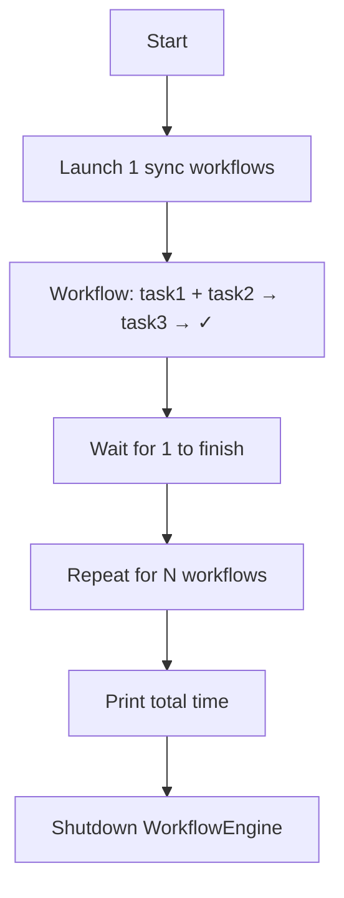
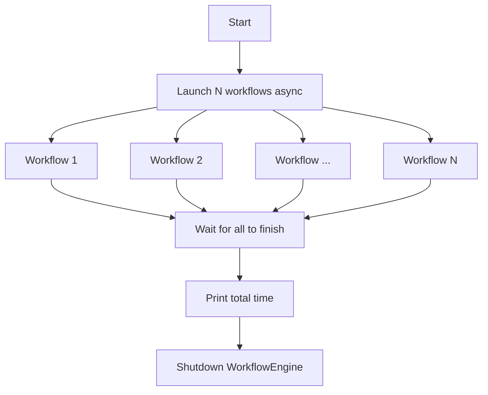

# Synchronous vs Asynchronous Programming with AsyncFlow

The goal of this documentation is to demonstrate the power of asynchronous programming enabled by AsyncFlow for both blocking and non-blocking tasks, workflows, and workflow compositions. We'll compare synchronous and asynchronous approaches using Radical.AsyncFlow with N independent blocking workflows.

## Overview

!!! note
    This comparison focuses on execution patterns when dealing with multiple blocking workflows, showing how AsyncFlow simplifies concurrent execution compared to traditional synchronous approaches.

## Synchronous Workflows

In the synchronous approach, we submit 5 blocking workflows sequentially, waiting for each to complete before starting the next.



!!! warning "Performance Limitation"
Without AsyncFlow, this sequential execution is the only straightforward way to handle blocking workflows, potentially leading to significant performance overhead.

### Example Code

```python

import time
import asyncio

from radical.asyncflow import WorkflowEngine
from radical.asyncflow import ThreadExecutionBackend


execution_backend = ThreadExecutionBackend({'max_workers':5}) # (1)!
asyncflow = WorkflowEngine(execution_backend)

@asyncflow.function_task
def task1(*args) -> float:
    return time.time()

@asyncflow.function_task
def task2(*args) -> float:
    return time.time()

@asyncflow.function_task
def task3(*args) -> float:
    return time.time()

def run_wf(wf_id):
    print(f'Starting workflow {wf_id} at {time.time()}')
    t3 = task3(task1(), task2())
    t3.result() # Blocking operation so the entire workflow will block
    print(f'Workflow {wf_id} completed at {time.time()}')

start_time = time.time()
for i in range(5):
    run_wf(i)
end_time = time.time()

print(f'\nTotal time running asynchronously is: {end_time - start_time}')

flow.shutdown()
```

1. Execution backend is responsible for the actual invocation and execution of the
   workflow tasks.


??? "Workflow log"
    ```text
    ThreadPool execution backend started successfully
    Starting workflow 0 at 1752767170.8769035
    Workflow 0 completed at 1752767172.8996685
    Starting workflow 1 at 1752767172.8998585
    Workflow 1 completed at 1752767172.9331574
    Starting workflow 2 at 1752767172.9332473
    Workflow 2 completed at 1752767172.9652867
    Starting workflow 3 at 1752767172.9653795
    Workflow 3 completed at 1752767172.9974532
    Starting workflow 4 at 1752767172.9975636
    Workflow 4 completed at 1752767173.0295944

    Total time running asynchronously is: 2.153142213821411
    Shutdown is triggered, terminating the resources gracefully
    ```


!!! tip "Key Characteristics"
- Workflows execute one after another
- Total time is the sum of all workflow execution times
- Simple to implement but inefficient for independent tasks

### Asynchronous Workflows
In the asynchronous approach, we submit all 5 blocking workflows concurrently and wait for their completion.



!!! success "Performance Benefit"
This approach can significantly reduce total execution time by allowing independent workflows to run concurrently.


### Example Code

```python
%env FLOW_JUPYTER_ASYNC=TRUE
%env RADICAL_LOG_LVL="DEBUG"

import time
import asyncio
from radical.asyncflow import ConcurrentExecutionBackend
from concurrent.futures import ThreadPoolExecutor
from radical.asyncflow import WorkflowEngine

backend = ConcurrentExecutionBackend(ThreadPoolExecutor())
flow = WorkflowEngine(backend=backend)

async def main():
    @flow.function_task
    async def task1(*args):
        return time.time()

    @flow.function_task
    async def task2(*args):
        return time.time()

    @flow.function_task
    async def task3(*args):
        return time.time()

    async def run_wf(wf_id):
        print(f'Starting workflow {wf_id} at {time.time()}')
        t3 = task3(task1(), task2())
        await t3 # Blocking operation so the entire workflow will block
        print(f'Workflow {wf_id} completed at {time.time()}')

    start_time = time.time()
    await asyncio.gather(*[run_wf(i) for i in range(5)])
    end_time = time.time()

    print(f'\nTotal time running asynchronously is: {end_time - start_time}')

    # We are in an async context, so we have to use await
    await flow.shutdown()

asyncio.run(main())
```

??? "Workflow log"
    ```text
    ThreadPool execution backend started successfully
    Starting workflow 0 at 1752767251.5312994
    Starting workflow 1 at 1752767251.5316885
    Starting workflow 2 at 1752767251.5318878
    Starting workflow 3 at 1752767251.532685
    Starting workflow 4 at 1752767251.5327375
    Workflow 2 completed at 1752767251.5644567
    Workflow 0 completed at 1752767251.564515
    Workflow 1 completed at 1752767251.5645394
    Workflow 4 completed at 1752767251.5645616
    Workflow 3 completed at 1752767251.5645802

    Total time running asynchronously is: 0.03412771224975586
    Shutdown is triggered, terminating the resources gracefully
    ```


!!! tip "Key Characteristics"
- Workflows execute concurrently
- Total time is determined by the longest-running workflow
- More efficient but requires proper async/await syntax
- Better resource utilization


!!! important "When to Use Each"
- Use synchronous when workflows must run in sequence or have dependencies
- Use asynchronous when workflows are independent and you want better performance
