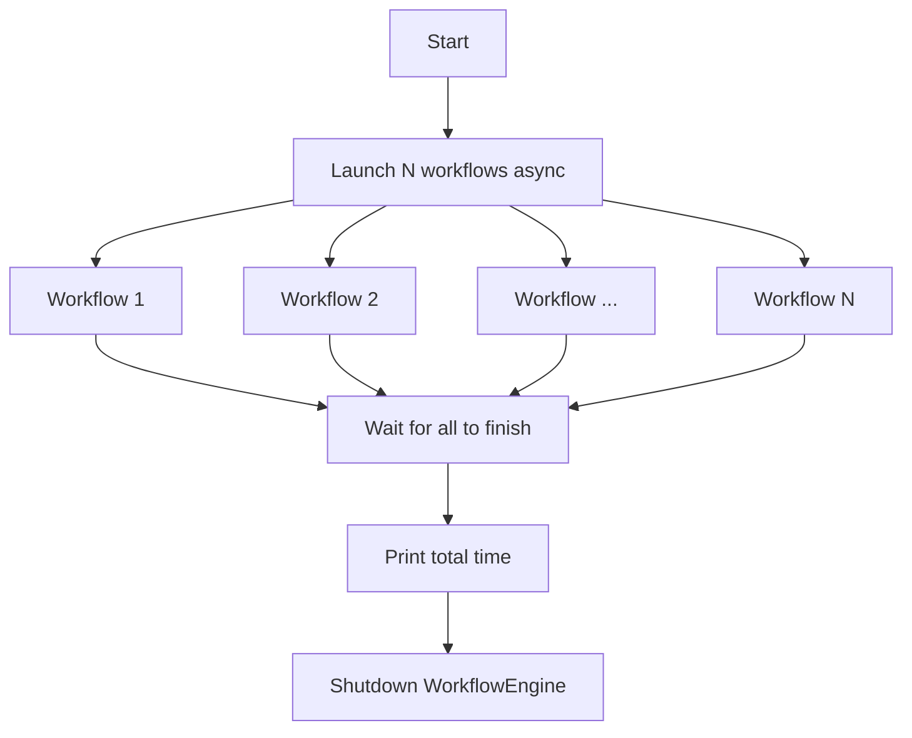

# Synchronous vs Asynchronous Programming with AsyncFlow

The goal of this documentation is to demonstrate the power of asynchronous programming enabled by AsyncFlow for both blocking and non-blocking tasks, workflows, and workflow compositions.


## Building Asynchronous Workflows
In the asynchronous approach, we submit all 5 blocking workflows concurrently and wait for their completion.


```mermaid
graph TD
    A[Start] --> B[Launch N workflows async]
    B --> C1[Workflow 1]
    B --> C2[Workflow 2]
    B --> C3[Workflow ...]
    B --> C4[Workflow N]
    C1 --> D[Wait for all to finish]
    C2 --> D
    C3 --> D
    C4 --> D
    D --> E[Print total time]
    E --> F[Shutdown WorkflowEngine]
```

!!! success "Performance Benefit"
    This approach can significantly reduce total execution time by allowing independent workflows to run concurrently.


### Example Code

```python

import time
import asyncio
from concurrent.futures import ThreadPoolExecutor
from radical.asyncflow import WorkflowEngine, LocalExecutionBackend

backend = await LocalExecutionBackend(ThreadPoolExecutor())
flow = await WorkflowEngine.create(backend=backend)

async def main():
    @flow.function_task
    async def task1(*args):
        return time.time()

    @flow.function_task
    async def task2(*args):
        return time.time()

    @flow.function_task
    async def task3(*args):
        return time.time()

    async def run_wf(wf_id):
        print(f'Starting workflow {wf_id} at {time.time()}')
        t3 = task3(task1(), task2())
        await t3 # Blocking operation so the entire workflow will block
        print(f'Workflow {wf_id} completed at {time.time()}')

    start_time = time.time()
    await asyncio.gather(*[run_wf(i) for i in range(5)])
    end_time = time.time()

    print(f'\nTotal time running asynchronously is: {end_time - start_time}')

    # We are in an async context, so we have to use await
    await flow.shutdown()

asyncio.run(main())
```

??? "Workflow log"
    ```text
    ThreadPool execution backend started successfully
    Starting workflow 0 at 1752767251.5312994
    Starting workflow 1 at 1752767251.5316885
    Starting workflow 2 at 1752767251.5318878
    Starting workflow 3 at 1752767251.532685
    Starting workflow 4 at 1752767251.5327375
    Workflow 2 completed at 1752767251.5644567
    Workflow 0 completed at 1752767251.564515
    Workflow 1 completed at 1752767251.5645394
    Workflow 4 completed at 1752767251.5645616
    Workflow 3 completed at 1752767251.5645802

    Total time running asynchronously is: 0.03412771224975586
    Shutdown is triggered, terminating the resources gracefully
    ```


!!! tip "Key Characteristics"
    - Workflows execute concurrently
    - Total time is determined by the longest-running workflow
    - More efficient but requires proper async/await syntax
    - Better resource utilization


!!! important "When to Use Each"
    - Use synchronous when workflows must run in sequence or have dependencies
    - Use asynchronous when workflows are independent and you want better performance

---

## Tagging Workflows with IDs

AsyncFlow provides two complementary ways to attach a `workflow_id` label to tasks, useful for
grouping related work in logs, dashboards, and telemetry.

### `workflow_scope()` — tag all tasks in a block of code

`workflow_scope()` is an async context manager. Every task submitted inside the `async with` block
inherits the given `workflow_id`:

```python
async with flow.workflow_scope("experiment-42") as wid:
    t1 = preprocess()
    t2 = train(t1)
    await t2
# all tasks submitted inside carry workflow_id="experiment-42"
```

If no ID is passed, a short UUID is generated automatically:

```python
async with flow.workflow_scope() as wid:
    print(wid)   # e.g. "wf-3a7f1c2b"
    my_task()
```

!!! note
    Scoping is per-engine instance. Multiple engines running in the same process each have their
    own independent scope — one engine's `workflow_scope()` never leaks into another engine's tasks.

### `workflow_id=` kwarg — tag a single task at call time

Pass `workflow_id=` directly when calling any task or block to tag only that component:

```python
result = my_task(workflow_id="run-007")
```

- Call-time `workflow_id=` takes precedence over any active `workflow_scope()`.
- The kwarg is stripped before being forwarded to the function body — the function never sees it.

### How workflow IDs are used

Workflow IDs flow through to the telemetry system when enabled, making it possible to filter
OTel spans and RHAPSODY JSONL events by workflow. They are also available on the component
description as `comp["description"]["workflow_id"]` for custom introspection.
