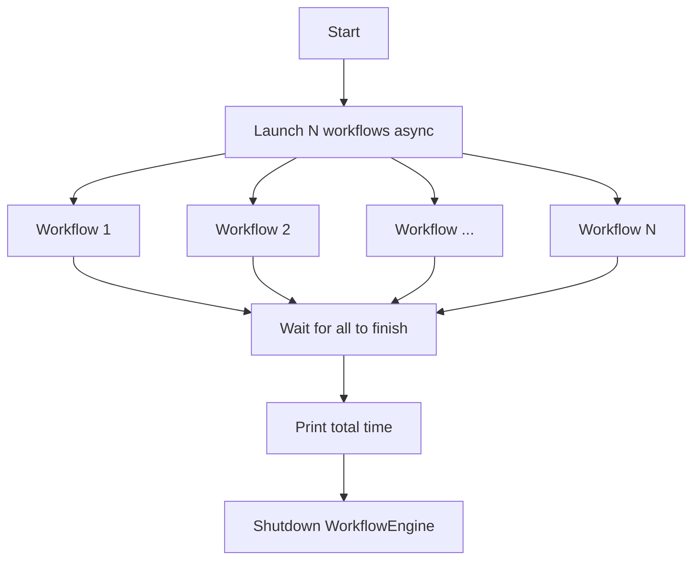

# Synchronous vs Asynchronous Programming with AsyncFlow

The goal of this documentation is to demonstrate the power of asynchronous programming enabled by AsyncFlow for both blocking and non-blocking tasks, workflows, and workflow compositions.


## Building Asynchronous Workflows
In the asynchronous approach, we submit all 5 blocking workflows concurrently and wait for their completion.



!!! success "Performance Benefit"
    This approach can significantly reduce total execution time by allowing independent workflows to run concurrently.


### Example Code

```python

import time
import asyncio
from radical.asyncflow import ConcurrentExecutionBackend
from concurrent.futures import ThreadPoolExecutor
from radical.asyncflow import WorkflowEngine

backend = await ConcurrentExecutionBackend(ThreadPoolExecutor())
flow = await WorkflowEngine.create(backend=backend)

async def main():
    @flow.function_task
    async def task1(*args):
        return time.time()

    @flow.function_task
    async def task2(*args):
        return time.time()

    @flow.function_task
    async def task3(*args):
        return time.time()

    async def run_wf(wf_id):
        print(f'Starting workflow {wf_id} at {time.time()}')
        t3 = task3(task1(), task2())
        await t3 # Blocking operation so the entire workflow will block
        print(f'Workflow {wf_id} completed at {time.time()}')

    start_time = time.time()
    await asyncio.gather(*[run_wf(i) for i in range(5)])
    end_time = time.time()

    print(f'\nTotal time running asynchronously is: {end_time - start_time}')

    # We are in an async context, so we have to use await
    await flow.shutdown()

asyncio.run(main())
```

??? "Workflow log"
    ```text
    ThreadPool execution backend started successfully
    Starting workflow 0 at 1752767251.5312994
    Starting workflow 1 at 1752767251.5316885
    Starting workflow 2 at 1752767251.5318878
    Starting workflow 3 at 1752767251.532685
    Starting workflow 4 at 1752767251.5327375
    Workflow 2 completed at 1752767251.5644567
    Workflow 0 completed at 1752767251.564515
    Workflow 1 completed at 1752767251.5645394
    Workflow 4 completed at 1752767251.5645616
    Workflow 3 completed at 1752767251.5645802

    Total time running asynchronously is: 0.03412771224975586
    Shutdown is triggered, terminating the resources gracefully
    ```


!!! tip "Key Characteristics"
    - Workflows execute concurrently
    - Total time is determined by the longest-running workflow
    - More efficient but requires proper async/await syntax
    - Better resource utilization


!!! important "When to Use Each"
    - Use synchronous when workflows must run in sequence or have dependencies
    - Use asynchronous when workflows are independent and you want better performance
