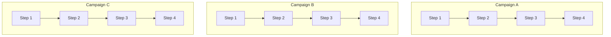

# Campaigns: Orchestrating Multiple Workflows

AsyncFlow provides built-in campaign management capabilities: the ability to define and execute multiple workflows (or sets of dependent tasks) concurrently — even when dependencies exist within each campaign.

This page walks you step by step through defining and running campaigns in AsyncFlow.

## What is a Campaign?
A campaign is a sequence of workflows or tasks with internal dependencies, run concurrently alongside other independent campaigns.



!!! note

- Each step in each campaign represent a workflow with dependent or independent tasks.

- All campaigns run concurrently, but each step within a campaign depends on the previous step.

## Example: Concurrent Campaigns

Below is a full working example using ThreadExecutionBackend and Python's asyncio to execute three campaigns in parallel, each with four dependent steps.

### Setup

```python
import time
import asyncio
from radical.asyncflow import ThreadExecutionBackend
from radical.asyncflow import WorkflowEngine

# + Create a backend and workflow engine
backend = ThreadExecutionBackend({})
asyncflow = WorkflowEngine(backend=backend)
```

!!! tip
The `ThreadExecutionBackend` allows you to leverage Python threads for parallel execution of independent workflows.


### Define Tasks

We now define a reusable task and a block representing one campaign.

```python
@asyncflow.function_task
async def workflow_step(name: str, step: int):
    now = time.time()
    print(f"[{now:.2f}] {name} - Step {step} started")
    await asyncio.sleep(0.5)  # simulate work
    print(f"[{time.time():.2f}] {name} - Step {step} completed")
    return now
```

!!! success
`@asyncflow.function_task` turns an async def function into an AsyncFlow task, which can be tracked, scheduled, and executed by the workflow engine.


### Define a Campaign Block

```python

# 
@asyncflow.block # (1)!
async def campaign(name: str):
    step1 = await workflow_step(name, 1)
    step2 = await workflow_step(name, 2)
    step3 = await workflow_step(name, 3)
    step4 = await workflow_step(name, 4)
    print(f"Campaign {name} completed at {time.time():.2f}")
```

1. Define one campaign (workflow of workflows)

!!! tip

The `@asyncflow.block` decorator groups a set of dependent tasks into a single logical unit (a "block").


### Run All Campaigns Concurrently

```python

start_time = time.time()

await asyncio.gather( # (1)!
    campaign("Campaign A"),
    campaign("Campaign B"),
    campaign("Campaign C"),
)

end_time = time.time()
print(f"\nTotal time running asynchronously is: {end_time - start_time:.2f}s")

# + Shutdown the workflow engine
await flow.shutdown()
```

1. Run all campaigns concurrently

??? "Campaigns log"
    ```text
    ThreadPool execution backend started successfully
    [1752775108.50] Campaign A - Step 1 started
    [1752775108.50] Campaign B - Step 1 started
    [1752775108.50] Campaign C - Step 1 started
    [1752775109.00] Campaign A - Step 1 completed
    [1752775109.00] Campaign C - Step 1 completed
    [1752775109.00] Campaign B - Step 1 completed
    [1752775110.00] Campaign A - Step 2 started
    [1752775110.00] Campaign C - Step 2 started
    [1752775110.00] Campaign B - Step 2 started
    [1752775110.50] Campaign A - Step 2 completed
    [1752775110.51] Campaign C - Step 2 completed
    [1752775110.51] Campaign B - Step 2 completed
    [1752775110.51] Campaign A - Step 3 started
    [1752775110.51] Campaign C - Step 3 started
    [1752775110.51] Campaign B - Step 3 started
    [1752775111.01] Campaign A - Step 3 completed
    [1752775111.02] Campaign C - Step 3 completed
    [1752775111.02] Campaign B - Step 3 completed
    [1752775112.02] Campaign A - Step 4 started
    [1752775112.02] Campaign C - Step 4 started
    [1752775112.02] Campaign B - Step 4 started
    [1752775112.52] Campaign A - Step 4 completed
    [1752775112.52] Campaign B - Step 4 completed
    [1752775112.52] Campaign C - Step 4 completed
    Campaign A completed at 1752775112.53
    Campaign C completed at 1752775112.53
    Campaign B completed at 1752775112.53

    Total time running asynchronously is: 4.05s
    ```

!!! note
- Each campaign executes steps sequentially.

- All campaigns run concurrently.

- AsyncFlow handles scheduling and dependencies automatically.

!!! warning
Do not forget to await flow.shutdown() when you are done — otherwise, resources may remain allocated.

!!! tip
You can replace ThreadExecutionBackend with RadicalExecutionBackend if you want to run on an HPC cluster instead of local threads.
