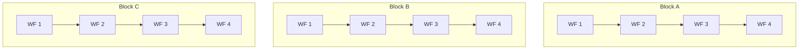

# Composite Workflows

AsyncFlow provides capabilities to define, construct, and combine multiple workflows into a single composite workflow. We refer to these composite workflow(s) as `Block(s)` - a logical grouping of dependent and independent workflows.

This page walks you step by step through defining and running composite workflows in AsyncFlow.




## Example: Independent Blocks

Below is a full working example using `ThreadExecutionBackend` and Python's asyncio to execute three blocks in parallel, each with four dependent steps.

### Setup

```python
import time
import asyncio
from radical.asyncflow import ThreadExecutionBackend
from radical.asyncflow import WorkflowEngine

backend = ThreadExecutionBackend({'max_workers': 4})
asyncflow = WorkflowEngine(backend=backend)
```

### Define Tasks

We now define 3 reusable tasks and a block representing one composite workflow.

```python
@asyncflow.function_task
async def create_workflow(name: str, step: int):
    now = time.time()
    print(f"[{now:.2f}] {name} - Step {step} started")
    await asyncio.sleep(0.5)  # simulate work
    print(f"[{time.time():.2f}] {name} - Step {step} completed")
    return now
```

!!! success
`@asyncflow.function_task` turns a regular `async` function into an `AsyncFlow` task, which can be tracked, scheduled, and executed by the workflow engine.

### Define a Composite Workflow Block

```python
@asyncflow.block # (1)!
async def create_block(name: str):
    step1 = await create_workflow(name, 1)
    step2 = await create_workflow(name, 2)
    step3 = await create_workflow(name, 3)
    step4 = await create_workflow(name, 4)
    print(f"Processing {name} completed at {time.time():.2f}")
```

1. Define one composite workflow block containing multiple dependent steps

!!! tip
The `@asyncflow.block` decorator groups a set of dependent tasks into a single logical unit (a "block"). This creates a composite workflow that can be executed dependently or independently from other blocks.

### Run All Blocks Concurrently

```python
start_time = time.time()

await asyncio.gather( # (1)!
    create_block("Block A"),
    create_block("Block B"),
    create_block("Block C"),
)

end_time = time.time()
print(f"\nTotal time running asynchronously is: {end_time - start_time:.2f}s")

await asyncflow.shutdown() # (2)!
```

1. Run all composite workflow blocks concurrently
2. Shutdown the workflow engine and terminate the resources

??? "Execution log"
    ```text
    ThreadPool execution backend started successfully
    [1752775108.50] Block A - workflow 1 started
    [1752775108.50] Block B - workflow 1 started
    [1752775108.50] Block C - workflow 1 started
    [1752775109.00] Block A - workflow 1 completed
    [1752775109.00] Block C - workflow 1 completed
    [1752775109.00] Block B - workflow 1 completed
    [1752775110.00] Block A - workflow 2 started
    [1752775110.00] Block C - workflow 2 started
    [1752775110.00] Block B - workflow 2 started
    [1752775110.50] Block A - workflow 2 completed
    [1752775110.51] Block C - workflow 2 completed
    [1752775110.51] Block B - workflow 2 completed
    [1752775110.51] Block A - workflow 3 started
    [1752775110.51] Block C - workflow 3 started
    [1752775110.51] Block B - workflow 3 started
    [1752775111.01] Block A - workflow 3 completed
    [1752775111.02] Block C - workflow 3 completed
    [1752775111.02] Block B - workflow 3 completed
    [1752775112.02] Block A - workflow 4 started
    [1752775112.02] Block C - workflow 4 started
    [1752775112.02] Block B - workflow 4 started
    [1752775112.52] Block A - workflow 4 completed
    [1752775112.52] Block B - workflow 4 completed
    [1752775112.52] Block C - workflow 4 completed
    Processing Block A completed at 1752775112.53
    Processing Block C completed at 1752775112.53
    Processing Block B completed at 1752775112.53

    Total time running asynchronously is: 4.05s
    ```

!!! note
- Each block executes its steps sequentially.
- All blocks run concurrently.
- AsyncFlow handles scheduling and dependencies automatically.

## Example: Blocks with Dependency
To represent the previous example as a `DAG` then all you need to do is to
pass the handler (future) of each the dependent block to the depended block as follows:

```python

block1 = create_block("Block A") # (1)!
block2 = create_block(block1, "Block B") # (2)!
block3 = create_block(block1, block2, "Block C") # (3)!

await block3
```

1. `block1` will execute first without any waiting.
2. `block2` will execute once `block1` finishes.
3. `block3` will run only after `block1` and `block2` finishes execution successfully.


??? "Execution log"
    ```text
    ThreadPool execution backend started successfully
    [1752775108.50] Block A - workflow 1 started
    [1752775109.00] Block A - workflow 1 completed
    [1752775109.01] Block A - workflow 2 started
    [1752775109.51] Block A - workflow 2 completed
    [1752775110.01] Block A - workflow 3 started
    [1752775110.51] Block A - workflow 3 completed
    [1752775111.01] Block A - workflow 4 started
    [1752775111.51] Block A - workflow 4 completed
    Processing Block A completed at 1752775111.52

    [1752775111.53] Block B - workflow 1 started
    [1752775112.03] Block B - workflow 1 completed
    [1752775112.04] Block B - workflow 2 started
    [1752775112.54] Block B - workflow 2 completed
    [1752775113.04] Block B - workflow 3 started
    [1752775113.54] Block B - workflow 3 completed
    [1752775114.04] Block B - workflow 4 started
    [1752775114.54] Block B - workflow 4 completed
    Processing Block B completed at 1752775114.55

    [1752775114.56] Block C - workflow 1 started
    [1752775115.06] Block C - workflow 1 completed
    [1752775115.07] Block C - workflow 2 started
    [1752775115.57] Block C - workflow 2 completed
    [1752775116.07] Block C - workflow 3 started
    [1752775116.57] Block C - workflow 3 completed
    [1752775117.07] Block C - workflow 4 started
    [1752775117.57] Block C - workflow 4 completed
    Processing Block C completed at 1752775117.58

    Total time running 1 DAG of 3 blocks is: 9.08s
    ```


!!! warning
Do not forget to `await asyncflow.shutdown()` when you are done — otherwise, resources may remain allocated.

!!! tip
You can replace `ThreadExecutionBackend` with `RadicalExecutionBackend` if you want to run on an HPC cluster instead of local threads.
