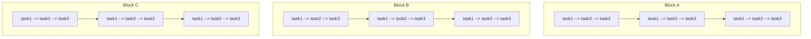

# Composite Workflows

AsyncFlow provides capabilities to define, construct, and combine multiple workflows into a single composite workflow. We refer to these composite workflow(s) as `Block(s)` - a logical grouping of dependent and independent workflows.

This page walks you step by step through defining and running composite workflows in AsyncFlow.



!!! note
`Block` entity can have DAG shaped workflows where some workflows depends on others. 

## Example: Independent Blocks

Below is a full working example using `ConcurrentExecutionBackend` and Python's asyncio to execute three blocks in parallel, each with four dependent steps.

### Setup

```python
import time
import asyncio
from radical.asyncflow import ConcurrentExecutionBackend
from radical.asyncflow import WorkflowEngine

from concurrent.futures import ThreadPoolExecutor

backend = await ConcurrentExecutionBackend(ThreadPoolExecutor())
async with WorkflowEngine.create(backend=backend) as flow:
```

### Define Tasks

We now define 3 reusable tasks and a block representing one composite workflow.

```python
@asyncflow.function_task
async def task1(name: str):
    now = time.time()
    print(f"[{now:.2f}] {name} started")
    await asyncio.sleep(0.5)  # simulate work
    print(f"[{time.time():.2f}] {name} completed")
    return now

@asyncflow.function_task
async def task2(name: str):
    now = time.time()
    print(f"[{now:.2f}] {name} started")
    await asyncio.sleep(0.5)  # simulate work
    print(f"[{time.time():.2f}] {name} completed")
    return now

@asyncflow.function_task
async def task3(name: str, *args):
    now = time.time()
    print(f"[{now:.2f}] {name} started")
    await asyncio.sleep(0.5)  # simulate work
    print(f"[{time.time():.2f}] {name} completed")
    return now
```

```python
async def create_workflow(name):
    now = time.time()
    print(f"[{now:.2f}] {name} started")
    t1 = task1('task1')
    t2 = task2('task2')
    t3 = task3('task3', t1, t2)
    await t3
    print(f"[{time.time():.2f}] {name} completed")
```

!!! success
`@asyncflow.function_task` turns a regular `async` function into an `AsyncFlow` task, which can be tracked, scheduled, and executed by the workflow engine.

### Define a Composite Workflow Block

```python
@asyncflow.block # (1)!
async def create_block(name: str, *args):
    wf1 = await create_workflow('WF1')
    wf2 = await create_workflow('WF2')
    wf3 = await create_workflow('WF3')
    print(f"Processing {name} completed at {time.time():.2f}")
```

1. Define one composite workflow block containing multiple dependent steps

!!! tip
The `@asyncflow.block` decorator groups a set of dependent tasks into a single logical unit (a "block"). This creates a composite workflow that can be executed dependently or independently from other blocks.

### Run All Blocks Concurrently

```python
start_time = time.time()

await asyncio.gather( # (1)!
    create_block("Block A"),
    create_block("Block B"),
    create_block("Block C"),
)

end_time = time.time()
print(f"\nTotal time running asynchronously is: {end_time - start_time:.2f}s")

```

1. Run all composite workflow blocks concurrently
2. Shutdown the workflow engine and terminate the resources

??? "Execution log"
    ```text
    Concurrent execution backend started successfully
    [1753116467.34] WF1 started
    [1753116467.34] WF1 started
    [1753116467.34] WF1 started
    [1753116467.35] task1 started
    [1753116467.35] task2 started
    [1753116467.35] task1 started
    [1753116467.35] task2 started
    [1753116467.85] task1 completed
    [1753116467.85] task2 completed
    [1753116467.85] task1 completed
    [1753116467.85] task2 completed
    [1753116467.86] task1 started
    [1753116467.86] task2 started
    [1753116468.36] task1 completed
    [1753116468.36] task2 completed
    [1753116468.86] task3 started
    [1753116468.86] task3 started
    [1753116468.86] task3 started
    [1753116469.36] task3 completed
    [1753116469.36] task3 completed
    [1753116469.36] task3 completed
    [1753116469.38] WF1 completed
    [1753116469.38] WF2 started
    [1753116469.38] WF1 completed
    [1753116469.38] WF2 started
    [1753116469.38] WF1 completed
    [1753116469.38] WF2 started
    [1753116469.39] task2 started
    [1753116469.39] task1 started
    [1753116469.39] task1 started
    [1753116469.39] task2 started
    [1753116469.89] task1 completed
    [1753116469.89] task2 completed
    [1753116469.89] task1 completed
    [1753116469.89] task1 started
    [1753116469.89] task2 completed
    [1753116469.89] task2 started
    [1753116470.39] task1 completed
    [1753116470.39] task2 completed
    [1753116470.89] task3 started
    [1753116470.89] task3 started
    [1753116470.89] task3 started
    [1753116471.39] task3 completed
    [1753116471.39] task3 completed
    [1753116471.39] task3 completed
    [1753116471.42] WF2 completed
    [1753116471.42] WF3 started
    [1753116471.42] WF2 completed
    [1753116471.42] WF3 started
    [1753116471.42] WF2 completed
    [1753116471.42] WF3 started
    [1753116471.42] task1 started
    [1753116471.42] task1 started
    [1753116471.42] task2 started
    [1753116471.42] task2 started
    [1753116471.92] task1 completed
    [1753116471.92] task1 completed
    [1753116471.93] task2 completed
    [1753116471.93] task2 completed
    [1753116471.93] task1 started
    [1753116471.93] task2 started
    [1753116472.43] task2 completed
    [1753116472.43] task1 completed
    [1753116472.92] task3 started
    [1753116472.93] task3 started
    [1753116472.93] task3 started
    [1753116473.43] task3 completed
    [1753116473.43] task3 completed
    [1753116473.43] task3 completed
    [1753116473.45] WF3 completed
    Processing Block C completed at 1753116473.45
    [1753116473.45] WF3 completed
    Processing Block A completed at 1753116473.45
    [1753116473.45] WF3 completed
    Processing Block B completed at 1753116473.45

    Total time running asynchronously is: 6.12s
    Shutdown is triggered, terminating the resources gracefully
    ```

!!! note
- Each block executes its steps sequentially.
- All blocks run concurrently.
- AsyncFlow handles scheduling and dependencies automatically.

## Example: Blocks with Dependency
To represent the previous example as a `DAG` then all you need to do is to
pass the handler (future) of each the dependent block to the depended block as follows:

```python
block1 = create_block("Block A") # (1)!
block2 = create_block("Block B") # (2)!
block3 = create_block("Block C", block1, block2) # (3)!

await block3
```

1. `block1` will execute first without any waiting.
2. `block2` will execute at the same time of  `block1` without any waiting (in parallel).
3. `block3` will run only after `block1` and `block2` finishes execution successfully.


??? "Execution log"
    ```text
    Concurrent execution backend started successfully
    [1753116817.42] WF1 started
    [1753116817.42] WF1 started
    [1753116817.43] task1 started
    [1753116817.43] task2 started
    [1753116817.43] task1 started
    [1753116817.43] task2 started
    [1753116817.93] task1 completed
    [1753116817.93] task2 completed
    [1753116817.93] task2 completed
    [1753116817.93] task1 completed
    [1753116818.93] task3 started
    [1753116818.93] task3 started
    [1753116819.43] task3 completed
    [1753116819.43] task3 completed
    [1753116819.46] WF1 completed
    [1753116819.46] WF2 started
    [1753116819.46] WF1 completed
    [1753116819.46] WF2 started
    [1753116819.47] task2 started
    [1753116819.47] task1 started
    [1753116819.47] task2 started
    [1753116819.47] task1 started
    [1753116819.97] task2 completed
    [1753116819.97] task1 completed
    [1753116819.97] task2 completed
    [1753116819.97] task1 completed
    [1753116820.97] task3 started
    [1753116820.97] task3 started
    [1753116821.47] task3 completed
    [1753116821.47] task3 completed
    [1753116821.50] WF2 completed
    [1753116821.50] WF3 started
    [1753116821.50] WF2 completed
    [1753116821.50] WF3 started
    [1753116821.50] task1 started
    [1753116821.50] task2 started
    [1753116821.50] task1 started
    [1753116821.50] task2 started
    [1753116822.00] task1 completed
    [1753116822.00] task2 completed
    [1753116822.00] task1 completed
    [1753116822.00] task2 completed
    [1753116823.00] task3 started
    [1753116823.01] task3 started
    [1753116823.51] task3 completed
    [1753116823.51] task3 completed
    [1753116823.53] WF3 completed
    Processing Block B completed at 1753116823.53
    [1753116823.53] WF3 completed
    Processing Block A completed at 1753116823.53
    [1753116823.55] WF1 started
    [1753116823.56] task1 started
    [1753116823.56] task2 started
    [1753116824.06] task2 completed
    [1753116824.06] task1 completed
    [1753116825.06] task3 started
    [1753116825.56] task3 completed
    [1753116825.59] WF1 completed
    [1753116825.59] WF2 started
    [1753116825.59] task1 started
    [1753116825.59] task2 started
    [1753116826.10] task1 completed
    [1753116826.10] task2 completed
    [1753116827.10] task3 started
    [1753116827.60] task3 completed
    [1753116827.63] WF2 completed
    [1753116827.63] WF3 started
    [1753116827.63] task1 started
    [1753116827.63] task2 started
    [1753116828.13] task1 completed
    [1753116828.13] task2 completed
    [1753116829.13] task3 started
    [1753116829.63] task3 completed
    [1753116829.66] WF3 completed
    Processing Block C completed at 1753116829.66

    Total time running asynchronously is: 12.25s
    Shutdown is triggered, terminating the resources gracefully
    ```


!!! tip
You can replace `ConcurrentExecutionBackend` with `RadicalExecutionBackend` if you want to run on an HPC cluster instead of local threads/processes.
