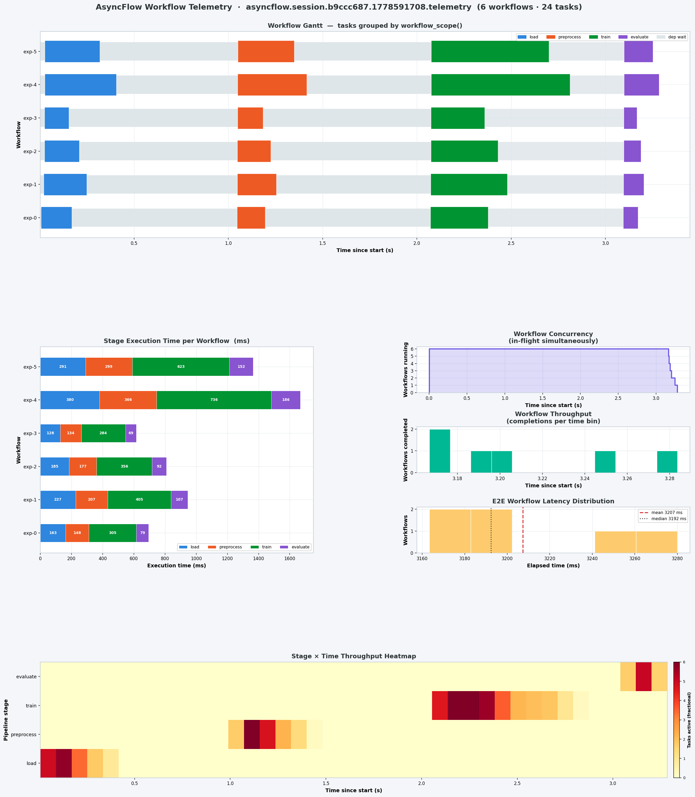

# Telemetry

AsyncFlow exposes the full RHAPSODY Telemetry Abstraction Layer (TAL) through a single call on the `WorkflowEngine`. This page covers what AsyncFlow adds on top of RHAPSODY's core telemetry and how application-level frameworks can consume the event stream.

For the complete reference on events, OTel instruments, JSONL format, Prometheus/Grafana integration, and custom event creation, see the [RHAPSODY Telemetry docs](https://radical-cybertools.github.io/rhapsody/telemetry/).

---

## Enabling telemetry

!!! note
    **Requires:** `pip install rhapsody-py[telemetry]`


```python
from concurrent.futures import ProcessPoolExecutor
from radical.asyncflow import WorkflowEngine
from rhapsody.backends import ConcurrentExecutionBackend

backend = await ConcurrentExecutionBackend(ProcessPoolExecutor())
flow = await WorkflowEngine.create(backend)

telemetry = await flow.start_telemetry(
    resource_poll_interval=5.0,        # node CPU/memory/GPU every 5 s
    checkpoint_path="./telemetry/",    # write a JSONL file (optional)
)
```

`start_telemetry()` returns a `TelemetryManager`. Stop it explicitly when done, or it stops automatically when the workflow engine shuts down:

```python
await flow.shutdown()   # also stops telemetry
# or explicitly:
await telemetry.stop()
```

### Forwarding to an external backend

Pass pre-built OTel `SpanProcessor` and/or `MetricReader` instances to forward data to Jaeger, Grafana Tempo, Honeycomb, Prometheus, or any other OTel-compatible backend:

```python
from opentelemetry.sdk.trace.export import BatchSpanProcessor
from opentelemetry.exporter.otlp.proto.http.trace_exporter import OTLPSpanExporter
from opentelemetry.sdk.metrics.export import PeriodicExportingMetricReader
from opentelemetry.exporter.otlp.proto.http.metric_exporter import OTLPMetricExporter

telemetry = await flow.start_telemetry(
    span_processors=[BatchSpanProcessor(OTLPSpanExporter())],
    metric_readers=[PeriodicExportingMetricReader(OTLPMetricExporter())],
)
```

Exporters read `OTEL_EXPORTER_OTLP_ENDPOINT`, `OTEL_EXPORTER_OTLP_HEADERS`, and `OTEL_SERVICE_NAME` from the environment. See [RHAPSODY Integrations](https://radical-cybertools.github.io/rhapsody/telemetry/integrations/) for the full parameter reference.

---

## Workflow grouping with `workflow_scope()`

By default all tasks share the same `session_id`. Use `workflow_scope()` to tag every task submitted inside the scope with a `asyncflow.workflow_id` attribute — enabling per-workflow filtering in Jaeger, Tempo, and the JSONL checkpoint:

```python
async with flow.workflow_scope("etl-run-42"):
    raw = ingest("source.csv")
    val = validate(raw)
    result = await report(val)
```

Every span and JSONL event emitted inside the scope carries `asyncflow.workflow_id = "etl-run-42"`. The scope maps directly onto a named OTel span (`name="workflow"`), so the flame graph in Tempo shows `session → workflow(etl-run-42) → task` hierarchy.

If no `workflow_id` is passed, one is auto-generated (`wf-<hex8>`).

```python
# Auto-ID
async with flow.workflow_scope() as wid:
    print(wid)   # e.g. "wf-3a1b9c2d"
```

`@flow.block`-decorated functions are automatically tagged with the block's UID as the `workflow_id` — no explicit `workflow_scope()` needed inside a block body.

### Visualising workflow telemetry

The example in `examples/telemetry/01-workflow_grouping.py`
runs six parallel ML training pipelines (load → preprocess → train → evaluate), each
wrapped in a `workflow_scope()`. Running the companion plotting script against the
JSONL checkpoint:

```bash
python examples/telemetry/01-workflow_grouping.py --out results/
python examples/telemetry/plot_workflow_gantt.py results/
```

produces a six-panel dashboard:



| Panel | What it shows |
|---|---|
| **Workflow Gantt** | One row per workflow instance; coloured bars = pipeline stages; light band = dependency wait |
| **Stage Execution Time** | Stacked bars in ms per stage per workflow — reveals which stage dominates each run |
| **Workflow Concurrency** | In-flight workflows over time — shows scheduler saturation |
| **Workflow Throughput** | Completion histogram — when pipelines finish relative to session start |
| **E2E Latency Distribution** | Histogram of total elapsed time per workflow with mean/median lines |
| **Stage × Time Heatmap** | 2-D heatmap (stages × time bins): task occupancy per cell — reveals bottleneck stages |

---

## OTel span hierarchy

When telemetry is enabled, AsyncFlow produces a four-level span tree:

```
Trace (one per session)
└── session span  [SessionStarted … SessionEnded]
    │
    ├── workflow span  [workflow_scope("etl-run-42")]
    │   ├── task span  task_id=ingest-001
    │   ├── task span  task_id=validate-001
    │   └── task span  task_id=report-001
    │
    ├── block span  [execute_block("pipeline_block")]
    │   ├── task span  task_id=preprocess-001
    │   ├── task span  task_id=compute-001
    │   └── task span  task_id=store-001
    │
    └── task span  (ungrouped — submitted outside any scope)
```

The `asyncflow.workflow_id` attribute is stamped on every task span and every JSONL lifecycle event inside a scope. This makes per-workflow Gantt views, performance comparison across workflow types, and span filtering all possible without any post-processing join.

---

## AsyncFlow-specific events

AsyncFlow emits one event that RHAPSODY core does not:

### `asyncflow.TaskResolved`

Emitted when all upstream dependencies of a task are satisfied — the moment the task becomes eligible for submission. Tasks with dependencies emit it when the last upstream `TaskCompleted` fires.

`asyncflow.TaskResolved` is defined using [`define_event()`](https://radical-cybertools.github.io/rhapsody/telemetry/reference/#custom-events-define_event) rather than being hard-coded in RHAPSODY, keeping the core event schema stable:

```python
# event_type = "asyncflow.TaskResolved"
# task_id    = "task.0003"
```

The `asyncflow.TaskResolved` is the **dependency wait time** — how long a task sat in the graph waiting for its inputs.

### Full lifecycle from the AsyncFlow perspective

```
-------------------------- User App Layer ---------------------------
CustomEvent1 (User app)
....
CustomEventN (User app)
-------------------------- AsyncFlow Layer --------------------------

TaskCreated              ← task registered in DAG (AsyncFlow)
    ↓
asyncflow.TaskResolved   ← all upstream deps satisfied (AsyncFlow)
    ↓
TaskSubmitted            ← handed to RHAPSODY session (AsyncFlow)
    ↓

-------------------------- RHAPSODY Layer --------------------------

(TaskQueued)             ← optional, backend-specific (RHAPSODY Backend)
    ↓
TaskStarted              ← worker begins execution (RHAPSODY Backend)
    ↓
TaskCompleted | TaskFailed | TaskCanceled (RHAPSODY Backend)
```

---

## Subscribing to events

Use `telemetry.subscribe()` to receive every event in real time. The callback can be sync or async and runs on the asyncio event loop.

```python
def on_event(event):
    print(event.event_type, event.task_id)

telemetry.subscribe(on_event)
```

**Filter by event type:**

```python
def on_event(event):
    if event.event_type == "TaskCompleted":
        print(f"done: {event.task_id}  {event.duration_seconds*1000:.0f} ms")
    elif event.event_type == "asyncflow.TaskResolved":
        print(f"resolved: {event.task_id}")
    elif event.event_type == "ResourceUpdate" and event.resource_scope == "per_node":
        print(f"cpu: {event.cpu_percent:.1f}%  mem: {event.memory_percent:.1f}%")
```

**Measure dependency wait time:**

```python
resolved_at = {}

def on_event(event):
    if event.event_type == "asyncflow.TaskResolved":
        resolved_at[event.task_id] = event.event_time
    elif event.event_type == "TaskStarted":
        dep_wait_ms = (event.event_time - resolved_at.get(event.task_id, event.event_time)) * 1000
        print(f"{event.task_id}: dep_wait={dep_wait_ms:.0f} ms")
```

---

## Reading results after the run

```python
await flow.shutdown()

summary = telemetry.summary()
print(summary["tasks"])
# {'submitted': 200, 'completed': 197, 'failed': 2, 'canceled': 1, 'running': 0}

if summary["duration"]:
    print(f"mean task time: {summary['duration']['mean_seconds']*1000:.1f} ms")
```

---

## Application-level frameworks

If you are building a framework on top of AsyncFlow (e.g. a domain-specific orchestrator, an ML pipeline library, a data processing layer), the telemetry bus is the right place to attach application-domain observability — without leaking implementation details back into AsyncFlow or RHAPSODY.

### Defining application events

Use `define_event()` to create typed event classes. Names must be namespaced (contain a dot). Base fields (`event_id`, `session_id`, `event_time`, etc.) are protected.

```python
from rhapsody.telemetry import define_event
from rhapsody.telemetry.events import make_event

# Define at module level
DataQualityChecked = define_event(
    "myframework.DataQualityChecked",
    dataset=str,
    score=float,
    rows_checked=int,
)

ModelCheckpoint = define_event(
    "myframework.ModelCheckpoint",
    step=(int, -1),
    loss=(float, float("inf")),
    metric=str,
)
```

### Emitting application events

Emit from your framework code (not from inside task functions — see [why](#emitting-from-inside-tasks)):

```python
# After a task result is available
result = await my_pipeline_task()

telemetry.emit(
    make_event(
        DataQualityChecked,
        session_id=telemetry.session_id,
        backend="myframework",
        dataset="train_2024",
        score=result["quality_score"],
        rows_checked=result["row_count"],
    )
)
```

`telemetry.emit()` is **synchronous** — no `await`.

### Subscribing in a framework layer

```python
class PipelineMonitor:
    def __init__(self, telemetry):
        self.violations = []
        self.checkpoints = []
        telemetry.subscribe(self._on_event)

    def _on_event(self, event):
        et = event.event_type

        if et == "TaskFailed":
            self.violations.append({
                "task_id": event.task_id,
                "error": event.error_type,
            })
        elif et == "TaskCanceled":
            # Cancellation is intentional — track separately from failures
            pass
        elif et == "myframework.DataQualityChecked":
            if event.score < 0.95:
                print(f"[ALERT] quality {event.score:.2%} on {event.dataset}")
        elif et == "myframework.ModelCheckpoint":
            self.checkpoints.append({"step": event.step, "loss": event.loss})

monitor = PipelineMonitor(telemetry)
```

### Emitting from inside tasks

**Do not call `telemetry.emit()` inside a task function.** Task functions are serialized by `cloudpickle` for subprocess execution. Capturing `telemetry` in the closure serializes its asyncio state, which fails at runtime.

```python
# ✗ WRONG — telemetry captured in closure, fails with cloudpickle
@flow.function_task
async def bad_task(data):
    result = process(data)
    telemetry.emit(...)   # ← do not do this
    return result

# ✓ CORRECT — emit after awaiting the task future, in the orchestration layer
async def run():
    result_fut = my_task(data)
    result = await result_fut
    telemetry.emit(make_event(MyEvent, ..., value=result["score"]))
```

---

## Further reading

- [RHAPSODY Telemetry Quick Start](https://radical-cybertools.github.io/rhapsody/telemetry/quickstart/) — enabling telemetry, reading metrics and spans
- [Events & Metrics Reference](https://radical-cybertools.github.io/rhapsody/telemetry/reference/) — all event fields, OTel instruments, JSONL format
- [Integrations & Extensions](https://radical-cybertools.github.io/rhapsody/telemetry/integrations/) — Prometheus, Grafana, Jaeger, MLflow, pandas
