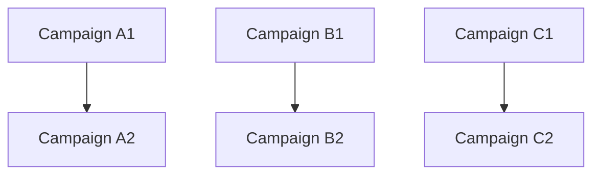

# Workflow of Campaigns: Orchestrating Dependent Campaign Sequences

AsyncFlow provides advanced campaign orchestration capabilities that go beyond simple concurrent execution. This page demonstrates how to create **workflows of campaigns** — where entire campaigns can depend on the completion of other campaigns, creating multi-tiered execution patterns.

## What is a Workflow of Campaigns?

A workflow of campaigns is a dependency structure where complete campaigns serve as prerequisites for subsequent campaigns. Unlike simple concurrent campaigns, this pattern creates vertical dependencies between campaign tiers.



- **Tier 1**: Campaigns A1, B1, C1 run concurrently
- **Tier 2**: Campaigns A2, B2, C2 wait for their respective Tier 1 campaigns to complete

## Example: Two-Tier Campaign Workflow

Below is a complete working example using `ThreadExecutionBackend` to execute a two-tier campaign workflow where second-tier campaigns depend on their corresponding first-tier campaigns.

### Setup

```python
import time
import asyncio
from radical.asyncflow import ThreadExecutionBackend

from radical.asyncflow import WorkflowEngine

# Create a backend and workflow engine
backend = ThreadExecutionBackend()
flow = WorkflowEngine(backend=backend)
```

### Define Tasks

We define a reusable task and a campaign block that can handle dependencies.

```python
@flow.function_task
async def workflow_step(name: str, step: int):
    now = time.time()
    print(f"[{now:.2f}] {name} - Step {step} started")
    await asyncio.sleep(0.5)  # simulate work
    print(f"[{time.time():.2f}] {name} - Step {step} completed")
    return now
```

!!! success
`@flow.function_task` creates an AsyncFlow task that can be tracked, scheduled, and executed by the workflow engine.

### Define a Campaign Block with Dependencies

```python
@flow.block # (1)!
async def campaign(name: str, *dependencies):
    # Wait for all dependencies to complete
    if dependencies:
        await asyncio.gather(*dependencies)
    
    # Execute campaign steps sequentially
    for step in range(1, 5):
        await workflow_step(name, step)
    
    print(f"[{time.time():.2f}] {name} completed")
```

1. Define a campaign that can wait for dependencies before executing

!!! tip
The `*dependencies` parameter allows campaigns to wait for upstream campaigns to complete before starting their own execution.

### Create Campaign Workflow

```python
# Submit the first tier of campaigns (independent)
campaign_a1_future = campaign("Campaign A1")
campaign_b1_future = campaign("Campaign B1") 
campaign_c1_future = campaign("Campaign C1")

# Submit the second tier of campaigns (dependent)
# Each second-tier campaign waits for its corresponding first-tier campaign
campaign_a2_future = campaign("Campaign A2", campaign_a1_future)
campaign_b2_future = campaign("Campaign B2", campaign_b1_future)
campaign_c2_future = campaign("Campaign C2", campaign_c1_future)
```

!!! note
- **Tier 1** campaigns have no dependencies and start immediately
- **Tier 2** campaigns depend on their corresponding Tier 1 campaigns completing

### Execute the Workflow

```python
start_time = time.time()

# Wait for all campaigns to complete
await asyncio.gather(
    campaign_a2_future, 
    campaign_b2_future, 
    campaign_c2_future
) # (1)!

end_time = time.time()
print(f"\nTotal time running asynchronously is: {end_time - start_time:.2f}s")

# Shutdown the workflow engine
await flow.shutdown()
```

1. Only need to wait for Tier 2 campaigns since they depend on Tier 1

??? "Campaign workflow log"
    ```text
    [1752775108.50] Campaign A1 - Step 1 started
    [1752775108.50] Campaign B1 - Step 1 started
    [1752775108.50] Campaign C1 - Step 1 started
    [1752775109.00] Campaign A1 - Step 1 completed
    [1752775109.00] Campaign B1 - Step 1 completed
    [1752775109.00] Campaign C1 - Step 1 completed
    [1752775109.00] Campaign A1 - Step 2 started
    [1752775109.00] Campaign B1 - Step 2 started
    [1752775109.00] Campaign C1 - Step 2 started
    [1752775109.50] Campaign A1 - Step 2 completed
    [1752775109.50] Campaign B1 - Step 2 completed
    [1752775109.50] Campaign C1 - Step 2 completed
    [1752775109.50] Campaign A1 - Step 3 started
    [1752775109.50] Campaign B1 - Step 3 started
    [1752775109.50] Campaign C1 - Step 3 started
    [1752775110.00] Campaign A1 - Step 3 completed
    [1752775110.00] Campaign B1 - Step 3 completed
    [1752775110.00] Campaign C1 - Step 3 completed
    [1752775110.00] Campaign A1 - Step 4 started
    [1752775110.00] Campaign B1 - Step 4 started
    [1752775110.00] Campaign C1 - Step 4 started
    [1752775110.50] Campaign A1 - Step 4 completed
    [1752775110.50] Campaign B1 - Step 4 completed
    [1752775110.50] Campaign C1 - Step 4 completed
    [1752775110.50] Campaign A1 completed
    [1752775110.50] Campaign B1 completed
    [1752775110.50] Campaign C1 completed
    [1752775110.50] Campaign A2 - Step 1 started
    [1752775110.50] Campaign B2 - Step 1 started
    [1752775110.50] Campaign C2 - Step 1 started
    [1752775111.00] Campaign A2 - Step 1 completed
    [1752775111.00] Campaign B2 - Step 1 completed
    [1752775111.00] Campaign C2 - Step 1 completed
    [1752775111.00] Campaign A2 - Step 2 started
    [1752775111.00] Campaign B2 - Step 2 started
    [1752775111.00] Campaign C2 - Step 2 started
    [1752775111.50] Campaign A2 - Step 2 completed
    [1752775111.50] Campaign B2 - Step 2 completed
    [1752775111.50] Campaign C2 - Step 2 completed
    [1752775111.50] Campaign A2 - Step 3 started
    [1752775111.50] Campaign B2 - Step 3 started
    [1752775111.50] Campaign C2 - Step 3 started
    [1752775112.00] Campaign A2 - Step 3 completed
    [1752775112.00] Campaign B2 - Step 3 completed
    [1752775112.00] Campaign C2 - Step 3 completed
    [1752775112.00] Campaign A2 - Step 4 started
    [1752775112.00] Campaign B2 - Step 4 started
    [1752775112.00] Campaign C2 - Step 4 started
    [1752775112.50] Campaign A2 - Step 4 completed
    [1752775112.50] Campaign B2 - Step 4 completed
    [1752775112.50] Campaign C2 - Step 4 completed
    [1752775112.50] Campaign A2 completed
    [1752775112.50] Campaign B2 completed
    [1752775112.50] Campaign C2 completed

    Total time running asynchronously is: 4.00s
    ```

!!! note
**Execution Pattern:**
- **Tier 1** campaigns (A1, B1, C1) execute concurrently and complete first
- **Tier 2** campaigns (A2, B2, C2) wait for their dependencies, then execute concurrently
- Total execution time is approximately 2 × (campaign duration) since tiers run sequentially

## Key Benefits

**Structured Dependencies**: Create clear dependency relationships between complete workflows, not just individual tasks.

**Parallel Efficiency**: Within each tier, campaigns still run concurrently for maximum efficiency.

**Scalable Architecture**: Easy to extend to multiple tiers or more complex dependency patterns.

**Resource Management**: AsyncFlow handles scheduling and resource allocation automatically.

!!! warning
Always call `await flow.shutdown()` when finished to properly clean up resources and prevent memory leaks.

!!! tip
This pattern can be extended to create more complex dependency graphs by passing multiple campaign futures as dependencies to subsequent campaigns.

## Advanced Usage

For more complex scenarios, you can create cross-dependencies where campaigns depend on multiple upstream campaigns from different branches:

```python
# Campaign D depends on both A1 and B1
campaign_d_future = campaign("Campaign D", campaign_a1_future, campaign_b1_future)
```

This flexibility allows you to model sophisticated workflow orchestration patterns using AsyncFlow's campaign management capabilities.